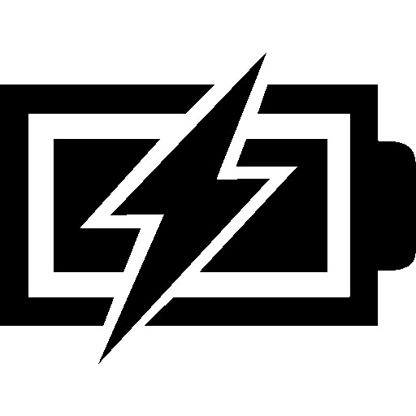

# detection-dock modular service

*detection-dock* is a Viam modular service that provides docking capabilities using a [vision service detector](https://docs.viam.com/services/vision/detection/)

The model this module makes available is viam-labs:dock:detection-dock

This service performs the following routine in attempts to "dock" a mobile robot:

1. Use a vision detector to detect if the selected class is found
2. If found, attempt to center detection within view by rotating left or right - then move forward
3. If detection takes up more than configured percent of the image, try docking by moving forward and wiggling back and forth, then seeing if the voltage increased.  If not, back up and go back to step 1.  If so, consider docked.
4. If not found, rotate counterclockwise
5. Go back to step 1

This has been tested with [feature match detection](https://github.com/viam-labs/feature-match-detector) configured as a vision detector, but other detector types should work, as well.
For docking with the feature match detector, we used the following image, but you can use others:


## Prerequisites

For linux:

``` bash
sudo apt update && sudo apt upgrade -y
sudo apt-get install python3
sudo apt install python3-pip python3-venv
```

You must also have configured a [base component](https://docs.viam.com/components/base/), [vision service detector](https://docs.viam.com/services/vision/detection/), and a [power sensor](https://docs.viam.com/components/power-sensor/)

## API

The detection-dock resource implements the [viam-labs action API](https://github.com/viam-labs/action-api).

Please use the API codebase to interact with a configured version of this service via Viam SDK.

## Viam Service Configuration

The following attributes may be configured as detection dock service config attributes.

For example: the following configuration would use "my_dock_feature_detector" to move base "my_base" to a detected "match", and then ensure docked by detecting a change in voltage with "my_power_sensor".

```json
{
    "power_sensor": "my_power_sensor",
    "base": "my_base",
    "detector": "my_dock_feature_detector",
    "detection_class": "match"
}
```

We used a [Viam Rover](https://www.viam.com/resources/rover) for a base, but other bases can be used - you might need to tweak some of the config settings and test until working fairly reliably.

### power_sensor

*string (required)*

The name of the configured [power sensor](https://docs.viam.com/components/power-sensor/)

### base

*string (required)*

The name of the configured [base component](https://docs.viam.com/components/base/)

### detector

*string (required)*

The name of the configured [vision service detector](https://docs.viam.com/services/vision/detection/)

### detection_class

*string (default: "match")*

The name of detection class(label) to be matched.

### spin_velocity

*integer (default: 800)*

velocity in degs/second when spinning

### straight_velocity

*integer (default: 350)*

velocity in degs/second when moving straight

### search_spin_deg

*integer (default: 4)*

degrees to spin when searching for detection

### straight_distance

*integer (default: 50)*

how far to move after centered on detection

### center_tolerance

*float (default: .05)*

Tolerance within the center of the detection is within the center of the image frame (.05 is 5 percent)

### detection_try_max

*integer (default: 4)*

Try up to this many times for a detection before search spinning

### close_percent

*float (default: .45)*

What percent of the frame should the detection be before final docking sequence (.45 is 45 percent)

### max_search_tries

*integer (default: 100)*

Max times to spin searching without seeing a detection before giving up

### max_dock_tries

*integer (default: 10)*

Max times to try final docking routine before giving up

## Troubleshooting

Add troubleshooting notes here.
