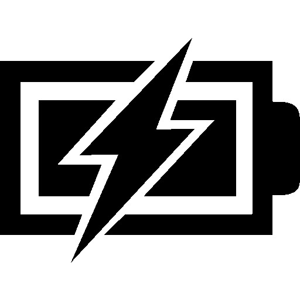

# detection-dock modular service

*detection-dock* is a Viam modular service that provides docking capabilities using a [vision service detector](https://docs.viam.com/services/vision/detection/)

The model this module makes available is viam-labs:dock:detection-dock

Docking follows the same stages as the [Nav2 docking server](https://docs.nav2.org/rolling/tutorials/general_tutorials/using_docking/): find the dock, then run a vision-control loop that continuously refines the target while driving toward it. The approach uses Nav2's graceful control law (bearing and range estimated from the detection). There is no map or staging navigation — if the dock is not in view, the base spins until the detector sees it.

1. Spin until the detector sees `detection_class`, or until the base has turned `search_spin_deg` (default two full rotations).
2. Enter the vision-control loop. Each cycle, estimate bearing from where the detection sits in the image and range from how large it is, filter that pose, and command a smooth velocity toward it. If a depth image is available, also measure the tilt of the surface inside the detection. Heading corrections happen outside `align_distance`, where the base can still spin. Inside that distance the robot drives straight. If it is still off, it backs up at most `align_backup_mm`, then turns in place instead of reversing farther.
3. Leave the loop once the detection is centered within `center_tolerance` and at least `close_percent` of the image wide. With depth, the surface also has to be within `surface_yaw_tolerance_deg` of straight on. A centered detection can still be tilted, which makes the target look smaller than it does when the robot is square.
4. If `power_sensor` is set, wait up to `wait_charge_timeout` for the voltage to rise by `charge_voltage_delta`. If it does not, back up and retry, up to `max_retries`. If `power_sensor` is omitted, reaching the target is success.

This has been tested with [feature match detection](https://github.com/viam-labs/feature-match-detector) configured as a vision detector, but other detector types should work, as well.
For docking with the feature match detector, we used the following image, but you can use others:


## Prerequisites

For linux:

``` bash
sudo apt update && sudo apt upgrade -y
sudo apt-get install python3
sudo apt install python3-pip python3-venv git
```

You must also have configured a [base component](https://docs.viam.com/components/base/) and a [vision service detector](https://docs.viam.com/services/vision/detection/). A [power sensor](https://docs.viam.com/components/power-sensor/) is optional and is only used to confirm that charging started.

## API

The detection-dock resource implements the [viam-labs action API](https://github.com/viam-labs/action-api).

Please use the API codebase to interact with a configured version of this service via Viam SDK.

## Viam Service Configuration

The following attributes may be configured as detection dock service config attributes.

For example: the following configuration uses "my_camera" and "my_dock_feature_detector" to find a "match", and drives "my_base" to it. Reaching that target is success. Add `power_sensor` only if a voltage rise should confirm charging.

```json
{
    "base": "my_base",
    "camera": "my_camera",
    "detector": "my_dock_feature_detector",
    "detection_class": "match"
}
```

`base`, `camera`, and `detector` are required implicit dependencies. `power_sensor` is optional.

We used a [Viam Rover](https://www.viam.com/resources/rover) for a base, but other bases can be used. The base must support `SetVelocity`.

### base

*string (required)*

The name of the configured [base component](https://docs.viam.com/components/base/)

### camera

*string (required)*

The name of the configured [camera component](https://docs.viam.com/components/camera/). If `get_images` also returns an `image/vnd.viam.dep` depth frame, it is used to square the robot to the dock surface. That depth frame should be aligned with the color image.

### detector

*string (required)*

The name of the configured [vision service detector](https://docs.viam.com/services/vision/detection/)

### depth_camera

*string (optional)*

A separate [camera](https://docs.viam.com/components/camera/) to read depth from, when the color camera does not include a depth image. Ignored when the color camera already returns depth.

### power_sensor

*string (optional)*

The name of a configured [power sensor](https://docs.viam.com/components/power-sensor/). When set, docking succeeds only if voltage rises by `charge_voltage_delta` after the visual approach. When omitted, the visual approach alone is success.

### detection_class

*string (default: "match")*

Detection class label to track. If several match, the largest box is used.

### camera_fov_deg

*float (default: 70)*

Horizontal camera field of view, in degrees. Used to turn the detection's horizontal offset into a bearing.

### close_percent

*float (default: 0.45)*

Detection width, as a fraction of the image, that counts as having reached the dock.

### center_tolerance

*float (default: 0.05)*

How far the detection center may sit from the image center, as a fraction of image width, and still count as aligned. `0.05` is 5 percent.

### surface_yaw_tolerance_deg

*float (default: 5)*

How many degrees the dock surface may tilt, left versus right in the depth image, and still count as square. Used only when depth is available. `bearing_deg` stays the image-center bearing and can read 0 while this tilt is still large.

### docking_distance

*float (default: 0.30)*

Meters. Range is estimated from detection size so that a detection of width `close_percent` is this far away. This scales the approach controller; it is not a measured distance.

### align_distance

*float (default: twice `docking_distance`, 0.60)*

Meters. Center and square up while farther than this, then drive in without spinning. If the robot is already closer and still misaligned, it backs up no farther than `align_backup_mm`, then turns in place.

### align_backup_mm

*float (default: 150)*

Maximum reverse, in millimeters, during one approach when the robot is already inside `align_distance` and still misaligned. This keeps the alignment backup from traveling into other obstacles.

### align_gain

*float (default: 2.0)*

How hard to turn, in rad/s per radian of heading error, during that early alignment.

### k_phi, k_delta, beta, lambda

*float (defaults: 3.0, 2.0, 0.4, 2.0)*

Gains for the Nav2 graceful control law. `k_phi` pulls the heading onto the line of sight. `k_delta` pulls the robot onto the target heading. `beta` and `lambda` slow the robot when curvature is high.

### v_linear_min, v_linear_max

*float (defaults: 80, 150)*

Approach speed limits, in mm/s.

### v_angular_max

*float (default: 45)*

Maximum angular speed during the approach, in deg/s.

### search_angular_velocity

*float (default: 15)*

Spin speed while searching for the dock, in deg/s.

### search_spin_deg

*float (default: 720)*

How far to spin while searching, in degrees, before giving up. `720` is two full rotations.

### slowdown_radius

*float (default: 0.25)*

Meters. Linear speed scales down inside this distance to the approach goal.

### deceleration_max

*float (default: 1.0)*

Maximum deceleration, in m/s², used to limit approach speed.

### controller_frequency

*float (default: 8)*

Vision-control loop rate, in Hz.

### initial_perception_timeout

*float (default: 120)*

Safety limit, in seconds, for the search. The search normally ends at `search_spin_deg` first. At the default 15 deg/s, 720 degrees takes about 48 seconds.

### dock_approach_timeout

*float (default: 30)*

Seconds allowed for one approach.

### external_detection_timeout

*float (default: 1.0)*

Seconds the dock may leave the image during an approach before that attempt fails.

### max_retries

*integer (default: 3)*

Extra attempts after the first. A failed approach backs up by `backup_distance_mm` and tries again.

### backup_distance_mm

*integer (default: 300)*

How far to reverse, in millimeters, before a retry.

### wait_charge_timeout

*float (default: 5)*

Seconds to wait for a voltage rise after the visual approach. Used only when `power_sensor` is set.

### charge_voltage_delta

*float (default: 0.12)*

Voltage increase, in volts, that counts as charging. Used only when `power_sensor` is set.

### filter_coef

*float (default: 0.45)*

Exponential smoothing weight for the detected pose, from 0 to 1. Higher values trust the latest detection more.

`status` reports `is_running`, `is_docked`, `state` (`idle`, `searching`, `aligning`, `approaching`, `backing_up`, `waiting_charge`, `docked`, `failed`), `retry_count`, `bearing_deg`, `surface_yaw_deg`, `using_depth`, and `relative_size`.

## Troubleshooting

Add troubleshooting notes here.
